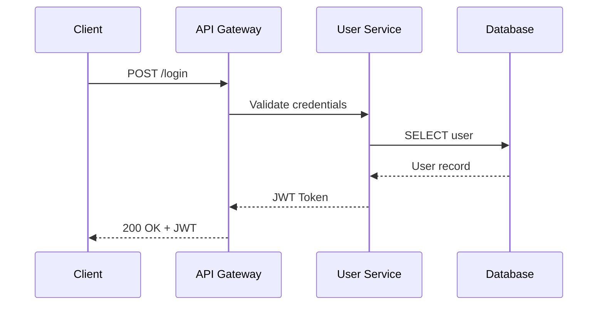
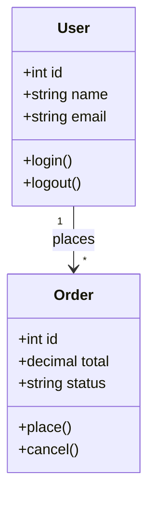
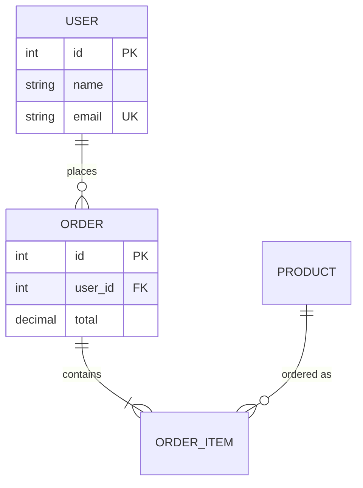
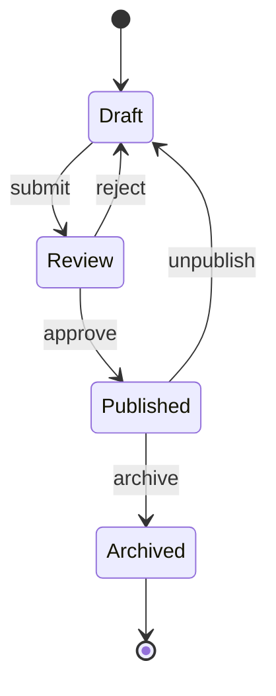

# Mermaid Conversion Guide (Pipeline B)

> How to generate `.drawio` diagrams from Mermaid syntax using the draw.io CLI.
> Pipeline B is the default for structure-first diagrams (sequence, ER, class, state machine).
>
> **When to read:** When the diagram type is structure-first and draw.io CLI ≥ v30 is available.
> Read this guide during SKILL.md Pipeline B Workflow Step 2 (Write Mermaid).
>
> **Prerequisite:** draw.io CLI ≥ v30.0.0. Check with `drawio --version`.

---

## Pipeline B Overview

```
User describes diagram → AI writes .mmd syntax → draw.io CLI converts to .drawio
→ validate.py → export preview → visual self-check → final export
```

Pipeline B is faster and more reliable than hand-writing XML for diagrams where:
- The structure (not visual aesthetics) is the primary concern
- Layout can be algorithmic (Mermaid's auto-layout is excellent)
- No custom shapes, vendor icons, or swimlane precision is needed

After conversion, the `.drawio` file goes through the **same quality pipeline** as hand-written XML (validate → export → self-check → review → final).

---

## Version Gate

```bash
drawio --version
```

| CLI Version | Pipeline B (Mermaid) | Pipeline C (XML) | `--layout` flag |
|-------------|---------------------|-------------------|-----------------|
| ≥ v30.0.0 | ✅ Available | ✅ Available | ✅ Available |
| < v30.0.0 | ❌ Unavailable | ✅ Available | ❌ Unavailable |

If CLI < v30, **always fall back to Pipeline C** (hand-written XML). Do not attempt Mermaid conversion.

---

## Supported Mermaid Diagram Types

draw.io CLI v30+ supports **28 Mermaid diagram types**:

| Category | Mermaid Types | Pipeline B Default? |
|----------|--------------|---------------------|
| **Structure-first** | `sequenceDiagram`, `classDiagram`, `erDiagram`, `stateDiagram-v2` | ✅ Yes (B default) |
| **Flow/Process** | `flowchart`, `graph` | ✅ Simple flowcharts |
| **Time/Planning** | `gantt`, `timeline` | ✅ Yes |
| **User/UX** | `journey`, `pie` | ✅ Yes |
| **Advanced** | `mindmap`, `kanban`, `gitGraph`, `sankey-beta`, `quadrantChart`, `block`, `xychart`, `radar`, `wardley`, `requirement` | ✅ Yes |
| **C4** | `c4Context`, `c4Container`, `c4Component`, `c4Dynamic`, `c4Deployment` | ✅ Yes |

**NOT suitable for Pipeline B** (always use Pipeline C):
- Architecture diagrams with swimlane containers
- Deployment diagrams with network zone boundaries
- Network topology with hexagon firewalls and cloud shapes
- Any diagram needing vendor icons (AWS, Azure, GCP)
- User explicitly requests "精美", "beautiful", "好看" styling

---

## CLI Conversion Command

```bash
# Step 1: Write .mmd file (AI writes Mermaid syntax)
# Step 2: Convert .mmd → .drawio
drawio -x -f xml -o output.drawio input.mmd

# Step 3: Keep the .mmd file (it's the editable source; .drawio is a derived artifact)
# Step 4: Continue with standard pipeline:
#   python3 scripts/validate.py output.drawio
#   node scripts/export.js output.drawio
```

**CRITICAL rules after conversion:**
- **Never** apply `--layout` to a Mermaid-converted file (it's already laid out)
- The converted file uses `UserObject`-wrapped cells — `validate.py` handles these correctly
- Keep the `.mmd` source file after successful conversion (it's the editable source)
- Treat the `.drawio` as the primary artifact from that point forward

---

## Mermaid Syntax Rules

### Diagram Type Declaration

The **first non-comment, non-directive line** must declare the diagram type. A misspelled keyword produces a **blank diagram** with no error message.

```mermaid
%% Correct:
sequenceDiagram
    Alice->>Bob: Hello

%% WRONG — misspelled:
sequenceDiagram   %% ← extra 'e', blank output
    Alice->>Bob: Hello
```

Correct keywords: `flowchart`, `graph`, `sequenceDiagram`, `classDiagram`, `erDiagram`, `stateDiagram-v2`, `gantt`, `mindmap`, `timeline`, `journey`, `pie`, `gitGraph`, `kanban`, `c4Context`, etc.

### Node IDs and Labels

- **Node IDs** are identifiers: no spaces, no trailing punctuation. Avoid Mermaid reserved words (`end`, `class`, `subgraph`).
- **Display text** goes in brackets or quotes:
  - `A[Rectangle]` — box
  - `B{Rhombus}` — diamond/decision
  - `C[(Database)]` — cylinder
  - `D((Circle))` — circle/ellipse
  - `E>Parallelogram]` — asymmetric shape
  - `A["Multi-word Label"]` — quoted label

### Statements

- **One statement per line.** Do not chain multiple operations on one line.
- **Quote labels** containing `:`, `-`, parentheses, or non-ASCII characters. Use double quotes `"`.
- **Line breaks** in labels: use `<br>` (one of the few reliable HTML tags).

### Styling

```mermaid
%% Individual node style
style A fill:#dae8fc,stroke:#6c8ebf,color:#000000

%% Reusable class definition
classDef primary fill:#dae8fc,stroke:#6c8ebf
class A,B,C primary

%% Edge style (by index, 0-based)
linkStyle 0 stroke:#6c8ebf,stroke-width:2px
linkStyle 1 stroke:#d6b656,stroke-width:1px
```

**Styling limitations:**
- Only hex colors supported (`#dae8fc`), never `rgb()` or named colors
- Edge styles use 0-based index (`linkStyle 0` = first edge declared)
- Cannot style individual arrow heads independently
- Cannot set per-edge dash patterns via Mermaid syntax

### HTML in Labels

Only these HTML tags are **reliably supported** in Mermaid labels:
- `<br>` — line break
- `<b>` — bold
- `<i>` — italic
- `<u>` — underline

Do NOT use: `<font>`, `<span>`, `<div>`, `<table>`, ``, or CSS styles.

### Language Matching

**Match label language to the user's input language.** If the user describes in Chinese, write Mermaid labels in Chinese. If in English, use English.

---

## Pipeline B Workflow (5 Steps)

### Step B1: Check CLI Version

```bash
drawio --version
```
If ≥ v30, proceed. If < v30, fall back to Pipeline C.

### Step B2: Write Mermaid (.mmd)

Write the Mermaid syntax to a `.mmd` file. Follow the syntax rules above. Use the type-specific presets from `references/diagram-types.md` for color styling (`style` and `classDef` statements).

**Required comment header** (every `.mmd` must start with these `%%` lines for discoverability):
```
%% title: <Human-readable diagram title>
%% type: <diagram type — sequence|er|class|state-machine>
%% keywords: <comma-separated keywords for search>
%% description: <One-line description of what this diagram shows>
```
The `%%` prefix is a Mermaid comment — ignored by renderers but searchable by the agent when the user says "modify the XXX diagram."

### Step B3: Convert to .drawio

```bash
node scripts/mermaid-convert.js .drawio/<name>.mmd --output .drawio/<name>.drawio
```
Keep the `.mmd` file after successful conversion — it is the **editable source**. The `.drawio` is a derived artifact. Both should be version-controlled.

### Step B4: Validate + Export + Self-Check

This is identical to Pipeline C Steps 3-5:
```bash
python3 scripts/validate.py .drawio/<name>.drawio
node scripts/export.js .drawio/<name>.drawio
# Visual self-check per references/visual-audit.md
```

### Step B5: Review + Final Export

Same as Pipeline C Step 6.

---

## Pipeline B vs C: Decision Flowchart

```
User requests a diagram
        │
        ▼
┌─ Is draw.io CLI ≥ v30? ──────────────────────────┐
│                                                    │
├─ YES → Continue                                    │
│                                                    │
│  ┌─ Diagram type? ─────────────────────────┐       │
│  │                                          │       │
│  ├─ Structure-first (sequence/ER/class/    │       │
│  │   state/gantt/mindmap/timeline)          │       │
│  │   └─ User wants "精美/beautiful"?        │       │
│  │      ├─ YES → Pipeline C (hand-write XML)│       │
│  │      └─ NO  → Pipeline B (Mermaid)       │       │
│  │                                          │       │
│  ├─ Layout-first (architecture/deployment/  │       │
│  │   flowchart/network/C4/data-flow)        │       │
│  │   └─ Pipeline C (hand-write XML)         │       │
│  └──────────────────────────────────────────┘       │
│                                                    │
├─ NO (CLI < v30) → Pipeline C always                │
└────────────────────────────────────────────────────┘
```

---

## Limitations (Why NOT Always Use Pipeline B)

| Limitation | Impact | Workaround |
|-----------|--------|------------|
| No vendor icons | Cannot use AWS/Azure/GCP shapes | Use Pipeline C |
| No custom shapes | Limited to Mermaid's shape vocabulary | Use Pipeline C |
| No swimlane precision | Cannot control lane widths, header sizes | Use Pipeline C |
| No per-edge dash patterns | All edges same style unless `linkStyle` | Accept or use Pipeline C |
| No z-order control | Mermaid auto-layout determines render order | Usually fine for structure-first diagrams |
| No exact coordinate control | Cannot place elements at specific x,y | Accept auto-layout |
| Styling via `linkStyle` index | Fragile — adding an edge shifts indices | Use `classDef` for nodes instead |

---

## Examples

### Sequence Diagram (Pipeline B)



### Class Diagram (Pipeline B)



### ER Diagram (Pipeline B)



### State Diagram (Pipeline B)



---

## Troubleshooting

| Symptom | Likely Cause | Fix |
|---------|-------------|-----|
| Blank output | Misspelled diagram type keyword | Check first non-comment line spelling |
| Blank output | Reserved word as node ID | Rename node ID (avoid `end`, `class`, `subgraph`) |
| Missing labels | Unquoted label with special chars | Quote labels with `:` `-` `()` or non-ASCII |
| Wrong colors | Using `rgb()` or named colors | Use hex colors only (`#dae8fc`) |
| Export failed | CLI < v30 | Fall back to Pipeline C |
| Overlapping elements | Mermaid auto-layout edge case | Accept or hand-tune in draw.io editor |
| Edge style not applying | Wrong `linkStyle` index | Count edges in declaration order (0-based) |
