[中文](README.md) | **English**

---

# xiaosu-draw-ai

> Universal AI diagramming skill — pure SKILL.md + draw.io CLI driven, not coupled to any specific Agent platform.

**Generate production-quality architecture, sequence, ER, flowchart, deployment, class, C4, state machine, network, and data flow diagrams** from natural language descriptions.

**Version:** 1.0.0 &nbsp;|&nbsp; **License:** MIT &nbsp;|&nbsp; [:blue_book: Design Doc](doc/DESIGN.md)

---

## About

xiaosu-draw-ai is an AI-powered diagramming skill that turns natural language into editable `.drawio` files. Based on the draw.io desktop CLI, it supports **10 diagram types** across **2 rendering pipelines**: Mermaid conversion (`.mmd` → `.drawio`) and AI hand-written XML (full layout control). Every diagram passes through **mandatory quality gates**: structural validation (P0-P2), heuristic visual audit (P3), and AI visual self-check.

The skill ships as a single directory — copy or symlink into any agent's skills directory. No API keys, no platform lock-in. Output is standard `.drawio` XML, editable in draw.io desktop, VS Code, or any MXGraph editor.

---

## Features

| Feature | Description |
|---------|-------------|
| **Natural Language → Diagram** | Describe in Chinese or English; 10 diagram types with 20 guided prompt templates |
| **2 Auto-Routed Pipelines** | B: Mermaid conversion (`.mmd`→`.drawio`, source preserved); C: AI hand-writes XML (full visual control). SQL/OpenAPI sources use importers as parsing helpers → Pipeline C |
| **7 Visual Styles** | Flat Icon (default), Dark Terminal, Blueprint, Notion Clean, Glassmorphism, Claude Official, OpenAI — with 7 semantic arrow kinds |
| **P0-P3 Quality Gates** | Auto structural check + heuristic visual audit + AI self-check; preview/final export separation; max 3 auto-repair rounds |
| **Modify Existing Diagrams** | Edit `.mmd` source → re-convert; parse `.drawio` XML → targeted edit; extract embedded XML from `.drawio.png`; auto-search by name; in-document Mermaid block editing |
| **Template-Driven Doc Gen** | Feed a template doc + requirements → AI infers diagram positions → generates text + diagrams into a complete document |
| **Cross-Platform** | Windows / macOS / Linux via draw.io CLI; auto-detection of CLI path (no manual PATH config needed) |

---

## Diagram Types

| Type | Trigger (EN) | Trigger (ZH) | Default Pipeline | Layout |
|------|-------------|-------------|-----------------|--------|
| **System Architecture** | "architecture", "microservices" | "架构图", "系统设计" | C | Top→down layers |
| **Sequence Diagram** | "sequence diagram" | "时序图", "交互流程" | B (Mermaid first) | Left→right, time↓ |
| **ER Diagram** | "ER diagram" | "ER图", "数据库设计" | B (Mermaid first) | Spread, min crossings |
| **Flowchart** | "flowchart", "workflow" | "流程图", "业务流程" | C | Top→down, branches |
| **Deployment** | "deployment" | "部署图", "基础设施" | C | Through security zones |
| **UML Class** | "class diagram" | "类图", "对象模型" | B (Mermaid first) | Inheritance↓, assoc→ |
| **C4 Model** | "C4", "container" | "C4", "容器图" | C | Person→System→External |
| **State Machine** | "state machine" | "状态机", "状态迁移" | B (Mermaid first) | Left→right states |
| **Network Topology** | "network", "topology" | "网络拓扑", "拓扑图" | C | Through network zones |
| **Data Flow** | "data flow", "pipeline" | "数据流", "DFD" | C | Top→down pipeline |

> **Pipeline note:** Structure-first diagrams (sequence/ER/class/state machine) default to Mermaid conversion (requires draw.io CLI ≥ v30); layout-first diagrams use AI hand-written XML. Saying "beautiful / polished" automatically switches to Pipeline C (full visual control).

**Suggested description format (structured):**

```
[Diagram type] System architecture
[Content]
1. 3 layers: frontend, services, data.
2. Frontend: React Web + Flutter App; Services: user, order, product, payment; Data: MySQL + Redis.
3. Frontend → API gateway (Kong, HTTPS), gateway → services (REST), services → databases (r/w), payment → Stripe (external).
[Style] Flat Icon or Notion Clean
```

<details>
<summary><b>📷 Sample output for all 10 diagram types (click to expand)</b></summary>

<table>
<tr>
<td width="50%" align="center"><b>System Architecture</b><br>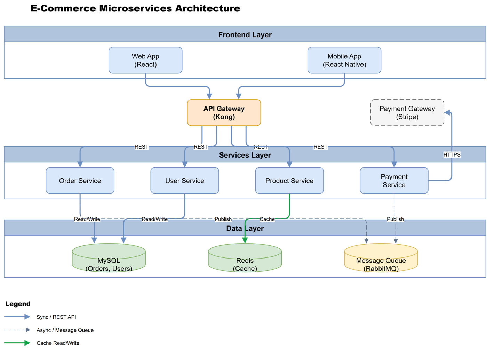</td>
<td width="50%" align="center"><b>Sequence Diagram</b><br>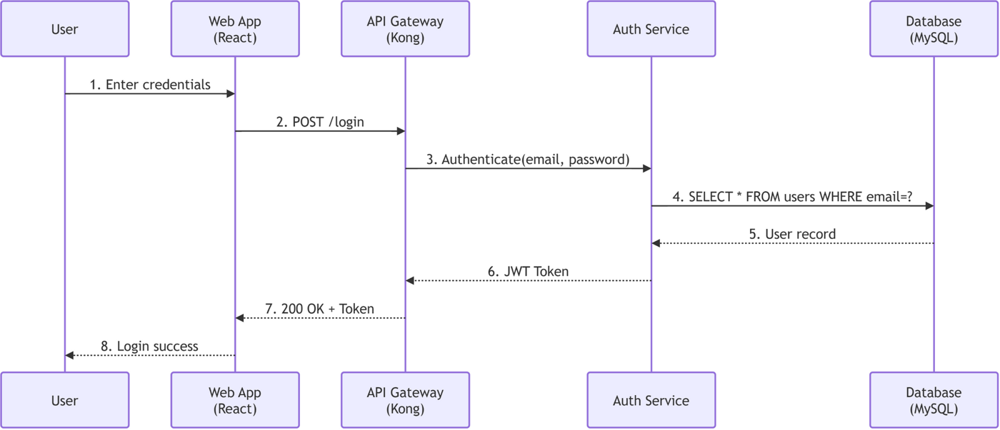</td>
</tr>
<tr>
<td align="center"><b>ER Diagram</b><br>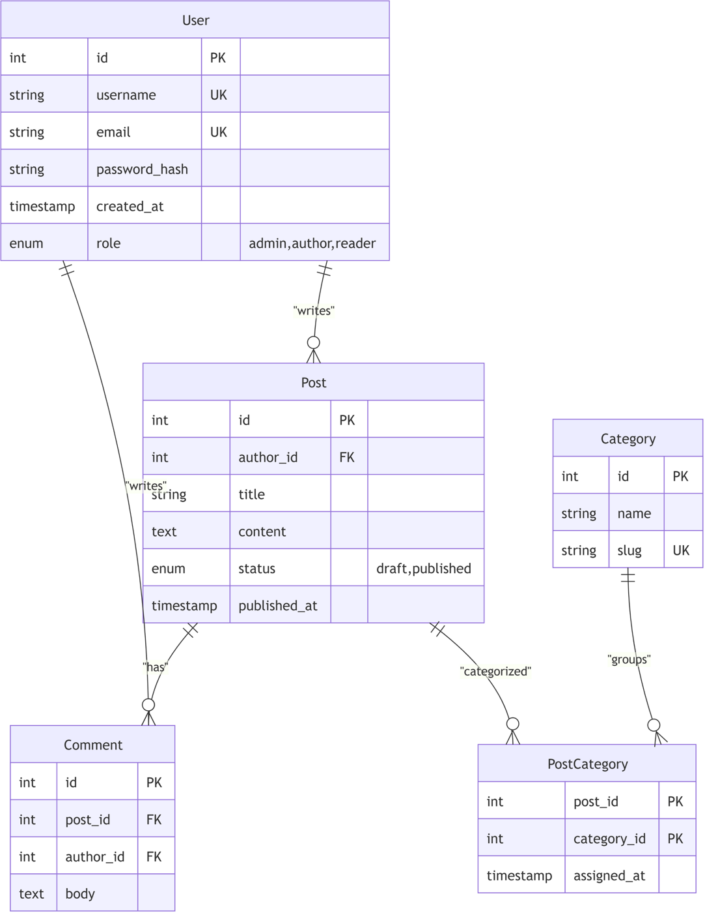</td>
<td align="center"><b>Flowchart</b><br>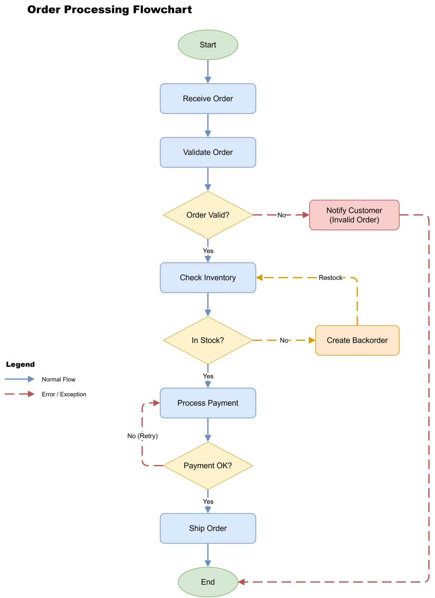</td>
</tr>
<tr>
<td align="center"><b>Deployment</b><br>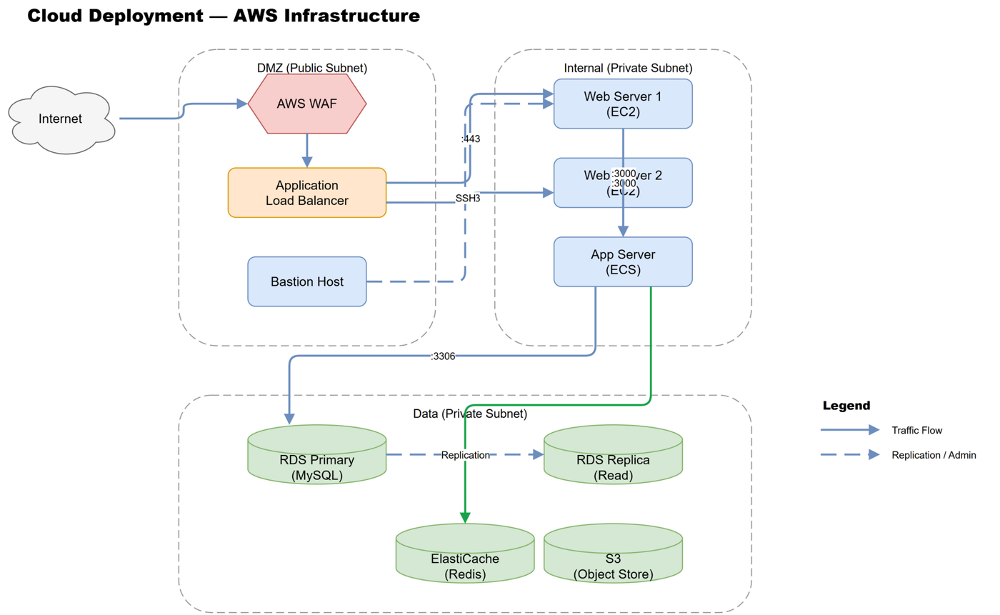</td>
<td align="center"><b>UML Class</b><br>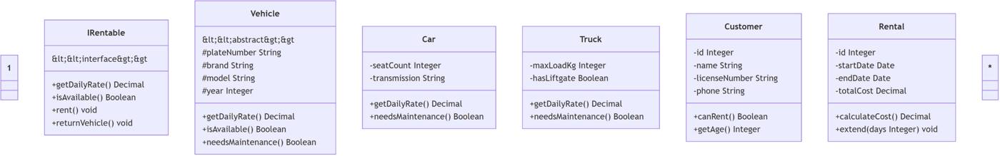</td>
</tr>
<tr>
<td align="center"><b>C4 Model</b><br>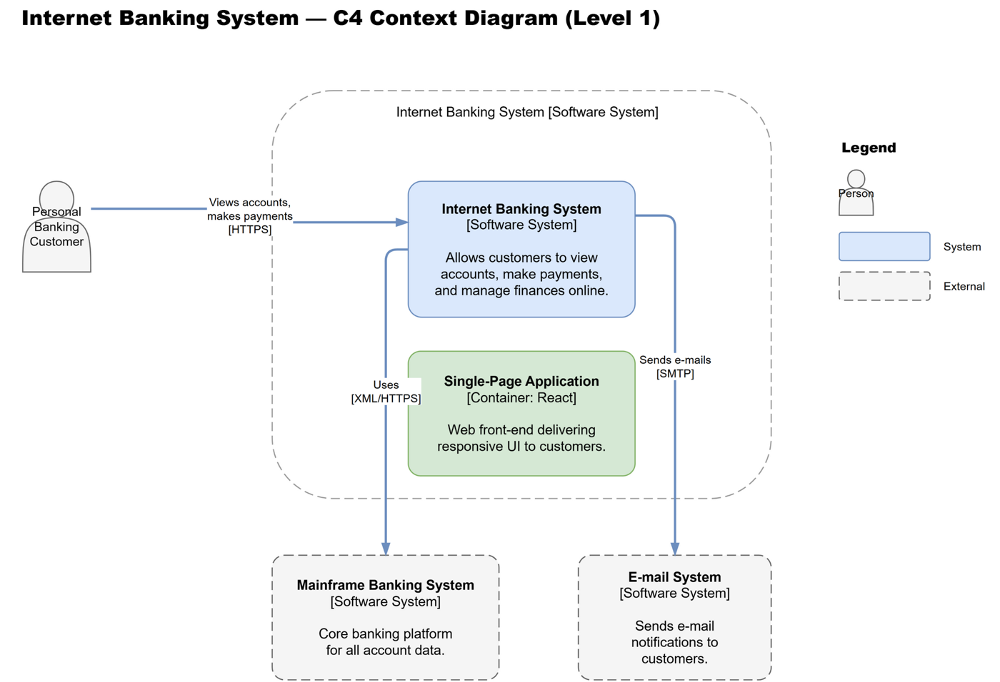</td>
<td align="center"><b>State Machine</b><br>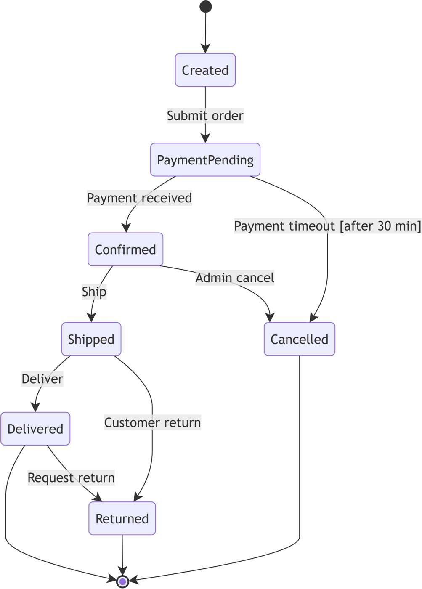</td>
</tr>
<tr>
<td align="center"><b>Network Topology</b><br>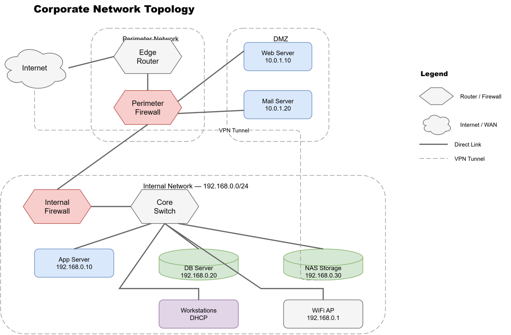</td>
<td align="center"><b>Data Flow</b><br>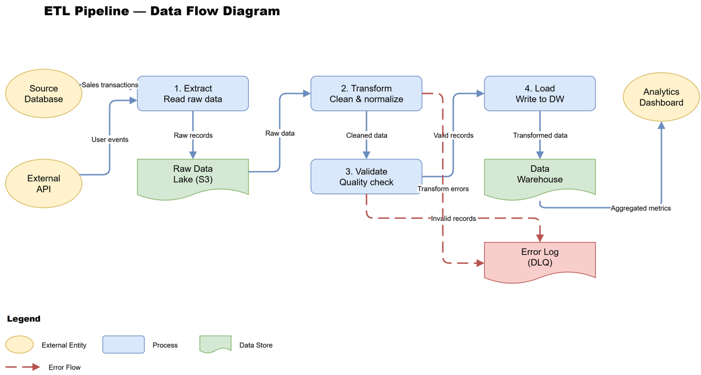</td>
</tr>
</table>

</details>

---

## Visual Styles

No design skills needed. Add a keyword to your description — the AI matches a style preset and fills every node by table lookup, **never coloring by gut feeling**.

| Style | Trigger (EN) | Trigger (ZH) | Look |
|-------|-------------|-------------|------|
| **Flat Icon** *(default)* | *(none)* | （不指定） | White bg, blue primary, rounded rects |
| **Dark Terminal** | "dark", "terminal" | "深色", "暗色" | Dark navy bg, neon colors, monospace |
| **Blueprint** | "blueprint" | "蓝图", "工程图" | Deep blue bg, white/cyan lines, square rects |
| **Notion Clean** | "clean", "minimal" | "简洁", "极简" | White bg, low-saturation gray, whitespace |
| **Glassmorphism** | "glass", "frosted" | "玻璃", "毛玻璃" | Dark gradient bg, frosted fills, depth |
| **Claude Official** | "claude style", "warm" | "暖色", "专业" | Warm white bg, soft shadows, Anthropic palette |
| **OpenAI** | "openai style", "spartan" | "极简", "简朴" | White bg, hairline strokes, brand green |

<details>
<summary><b>📷 Style samples (click to expand)</b></summary>

<table>
<tr>
<td width="50%" align="center"><b>Flat Icon</b> (default)<br>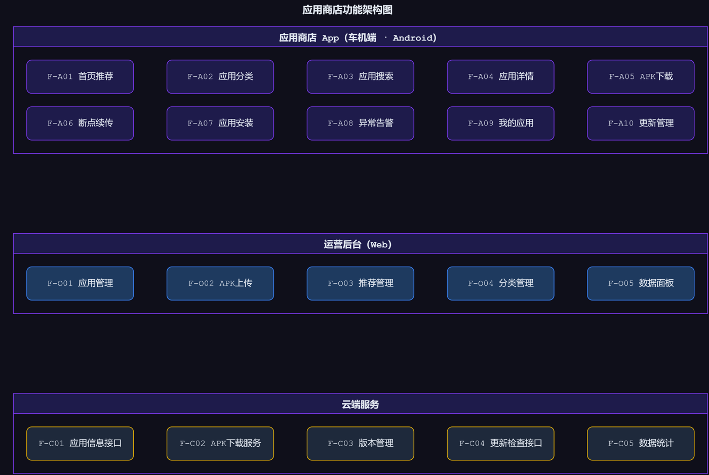</td>
<td width="50%" align="center"><b>Blueprint</b><br>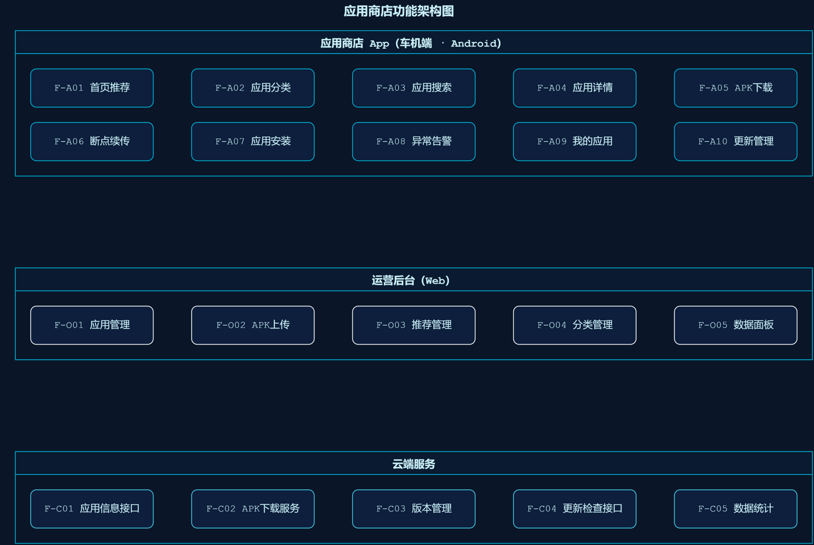</td>
</tr>
<tr>
<td align="center"><b>Notion Clean</b><br>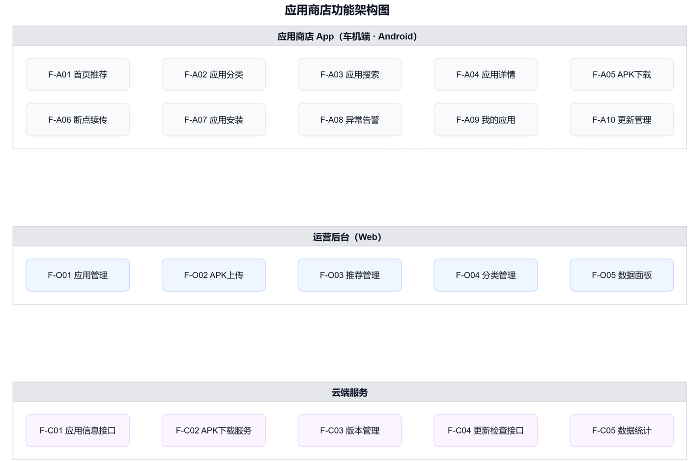</td>
<td align="center"><b>Glassmorphism</b><br>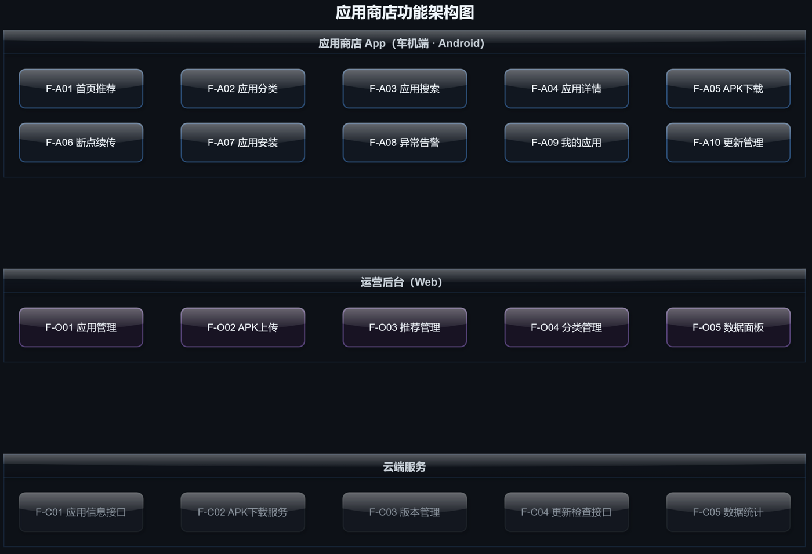</td>
</tr>
<tr>
<td align="center"><b>Claude Official</b><br>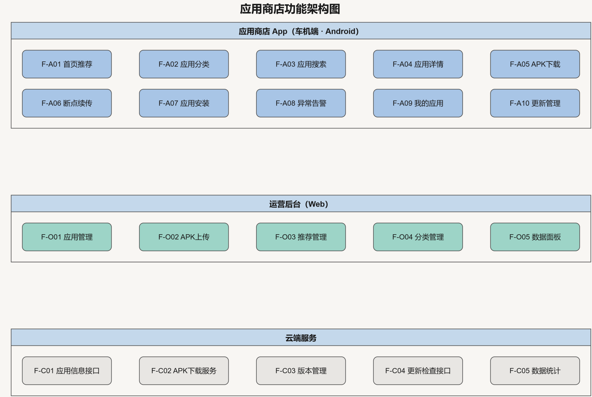</td>
<td align="center"><b>OpenAI</b><br>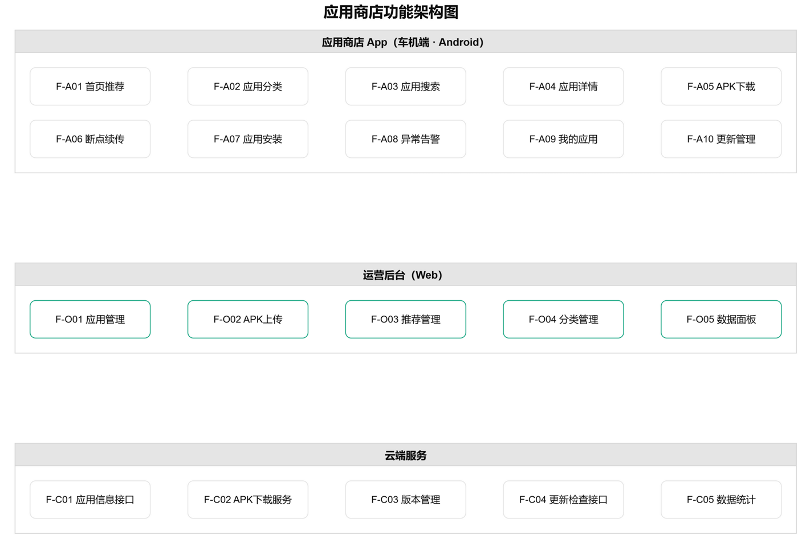</td>
</tr>
</table>

*Dark Terminal is a dark variant; layout resembles Blueprint.*

</details>

### Customizing Styles

Each style JSON has 7 fields:

| Field | Purpose | Example |
|-------|---------|---------|
| `palette` | 7-slot color palette (primary/success/warning/accent/danger/neutral/secondary) | `"primary": {"fillColor": "#dae8fc", "strokeColor": "#6c8ebf"}` |
| `roles` | Semantic role → palette slot mapping | `"database": "success"` |
| `shapes` | Node kind → draw.io style string | `"database": "shape=cylinder3;..."` |
| `font` | Family, sizes, title weight | `"fontFamily": "Helvetica", "fontSize": 12` |
| `edges` | Default edge style + arrow kinds | `"style": "edgeStyle=orthogonalEdgeStyle;..."` |
| `extras` | Globals (background, stroke width, rounding) | `"background": "#FFFFFF", "globalStrokeWidth": 1` |
| `bestFor` | Recommended diagram types | `["architecture", "er", "flowchart"]` |

**Create a new style (5 steps):** ① copy `styles/built-in/flat-icon.json` → ② edit `palette` colors → ③ adjust `roles` mapping → ④ validate against schema → ⑤ register in `references/style-presets.md` and the SKILL.md style selection table.

**Quick recolor:** change one slot to recolor globally. E.g. make all database nodes purple:

```json
"palette": { "success": { "fillColor": "#f3e5f5", "strokeColor": "#7b1fa2" } }
```

Lookup path: `roles.database → "success" → palette.success` — no script changes needed. Full protocol in `skills/xiaosu-draw-ai/references/style-presets.md`.

---

## Installation

### Prerequisites

| Tool | Min Version | Purpose | Install |
|------|-------------|---------|---------|
| [draw.io Desktop](https://www.drawio.com/) | ≥ 24.0.0 | CLI export engine (PNG/SVG/PDF) | Official site; macOS: `brew install --cask drawio` |
| [Python 3](https://www.python.org/downloads/) | ≥ 3.8 | Structural validation (validate.py) | Official site |
| [Node.js](https://nodejs.org/) | ≥ 14.0 | Export, build, audit, install scripts | Official site |

**Verify:**

```bash
drawio --version    # or draw.io --version
python3 --version
node --version
```

> `export.js` auto-detects the draw.io CLI across Windows/macOS/Linux (including default Windows install paths) — manual PATH configuration is usually unnecessary.

### Quick Install (Recommended)

```bash
# Symlink for development (changes take effect immediately)
# macOS / Linux
ln -s "$(pwd)/skills/xiaosu-draw-ai" ~/.claude/skills/xiaosu-draw-ai

# Windows (admin or Developer Mode)
mklink /D "%USERPROFILE%\.claude\skills\xiaosu-draw-ai" "<repo>\skills\xiaosu-draw-ai"
```

### Release Install

```bash
# 1. Build the distributable package
node skills/xiaosu-draw-ai/scripts/build.js

# 2. Copy into your agent's skills directory
# macOS / Linux
cp -r .claude/skills/xiaosu-draw-ai ~/.claude/skills/xiaosu-draw-ai

# Windows (PowerShell)
Copy-Item -Recurse .\.claude\skills\xiaosu-draw-ai $env:USERPROFILE\.claude\skills\xiaosu-draw-ai
```

> **Do NOT copy only `SKILL.md`** — `references/`, `scripts/`, `styles/`, and `templates/` must be colocated. Same for any generic Agent platform: install the whole `skills/xiaosu-draw-ai/` directory as the skill.

### One-Line Install

With an AI tool (e.g. Claude Code), just say:

```
Please install the xiaosu-draw-ai skill
```

The AI runs `install.js` to guide environment checks and installation:

```bash
node skills/xiaosu-draw-ai/scripts/install.js                      # interactive
node skills/xiaosu-draw-ai/scripts/install.js --check              # prerequisites only
node skills/xiaosu-draw-ai/scripts/install.js --agent claude-code  # target agent
```

---

## Modifying an Existing Diagram

The agent detects the diagram's **source format** and picks the editing strategy — each format is handled differently.

### 1. Mermaid source — edit source, regenerate

The **editable source** of a Mermaid diagram is the `.mmd` file or the mermaid code block in your document — **not** the generated `.drawio`.

| Scenario | Action | Note |
|----------|--------|------|
| `.mmd` file + change request | Edit `.mmd` → re-convert → validate → export | ⭐ **Best**: source-level edits, clean diffs |
| Diagram lives in a Wiki/Markdown mermaid block | Edit the code block → re-convert | ⭐ The document is the single source of truth |
| "Modify diagram X" without a file | Agent auto-searches for the matching `.mmd` | Search by name |
| `.drawio` contains `<UserObject>` (Mermaid-generated) | ⚠️ Direct XML edits are **fragile and overwritten on re-conversion**; rebuild the `.mmd` source first | Not recommended |

```bash
# 1. Edit the .mmd file (or the Mermaid block in your doc)
# 2. Re-convert
node skills/xiaosu-draw-ai/scripts/mermaid-convert.js diagram.mmd --output diagram.drawio
# 3. Validate + export
python3 skills/xiaosu-draw-ai/scripts/validate.py diagram.drawio
node skills/xiaosu-draw-ai/scripts/export.js diagram.drawio --final
```

### 2. Hand-written XML (.drawio) — edit XML directly

The XML of a hand-written `.drawio` is itself the source:

```bash
# AI parses structure → shows node/edge summary → applies targeted XML edits → validates → exports
node skills/xiaosu-draw-ai/scripts/xml-parser.js diagram.drawio --json
```

### 3. From PNG (`.drawio.png`, `--final` export)

```bash
node skills/xiaosu-draw-ai/scripts/png-extract.js diagram.drawio.png --output temp.drawio
```

> A plain PNG (no embedded XML) has no extractable source: ① locate the original `.drawio` / `.mmd`, or ② let the agent redraw from the image.

### Quality guarantee after edits

Whatever the editing path, the agent runs the full quality gates: structural validation (validate.py P0-P2) → visual audit (audit.js P3) → preview export for confirmation → final delivery of `.drawio` + `.drawio.png` (embedded editable source) + `.mmd` (kept for Mermaid-based diagrams).

---

## Template-Driven Document Generation

Two ways to combine diagrams with documents.

### Option 1: template + requirements → full document

Give the AI a design-doc template (Feishu Wiki / Markdown / Docx) plus requirements. **The AI infers required diagrams from the template itself:**

| Template contains | Inference | Reliability |
|-------------------|-----------|-------------|
| mermaid code block | Reads the code — type and structure fully known | ✅ Most reliable |
| `.drawio.png` file | Extracts the embedded XML source | ✅ Most reliable |
| Heading "System Architecture" | An architecture diagram goes here | ⚠️ Usually fine |
| Heading "Login Flow" | A sequence diagram goes here | ⚠️ Usually fine |
| Body text "three layers: frontend, services, data" | Infers layering and components | ⚠️ Depends on clarity |

Only when neither headings nor body text suffice, add a one-line hint (readable by humans anyway):

```markdown
## 3.1 Core Design

> An architecture diagram goes here, showing the frontend / gateway / services / data layers.
```

**Example:**

> "Use this template [link] + these requirements to generate an e-commerce system design doc: React + iOS frontend, Kong gateway, user/order/product services, MySQL + Redis."

The AI reads the template → shows a blueprint ("7 sections, 3 diagram slots…") → generates chapter by chapter → delivers the complete document.

### Option 2: inline diagram requests

Insert `@xiaosu-draw-ai` annotation blocks where diagrams belong:

```markdown
@xiaosu-draw-ai Draw the user login sequence diagram
[Type] Sequence diagram
[Content]
1. Participants: browser, web app, API gateway, auth service, database
2. Happy path: enter credentials → POST /login → verify → query DB → return JWT → success
3. Error branches: wrong password 401; account locked 423
[Style] Notion Clean
```

Then say "generate all diagrams in this article". Multiple requests per article are fine — the AI scans them all, lists them for confirmation, then generates one by one.

### The article changed — update the diagrams?

No manual rework. Say:

> "The article changed — update its diagrams."

The AI re-reads the article, diffs against the existing diagrams, and flags mismatches — e.g. "§2 now mentions Payment Service but the architecture diagram doesn't include it. Update?"

---

## Adding Diagram Types & Templates

Templates are Markdown files under `skills/xiaosu-draw-ai/templates/{zh|en}/`, used to guide requirement clarification.

**Add a new diagram type (3 steps):**

1. **Create the template** — `templates/{zh|en}/<type>.md` with: what it is / when to use / how to describe / examples / a **constraints section** (concrete spacing, shapes, edges, colors)
2. **Add the type preset** — new section in `references/diagram-types.md`: shape mapping (node kind → shape style), color assignment (role → palette slot), layout direction & spacing, edge semantics
3. **Register in SKILL.md** — add trigger words, template path, and pipeline to the template table

**Edit an existing template:** change its `## Constraints` section. Key rules:

- Concrete px values, not "appropriate spacing"
- Concrete shape names (`shape=cylinder3`), not "a database shape"
- Concrete color refs (`fillColor=#dae8fc`), not "blue"

---

## Quality System

| Level | Check | Blocks? | Detects |
|-------|-------|---------|---------|
| **P0** | `validate.py` | Yes (exit 2) | Dangling edges, duplicate IDs, XML corruption |
| **P1** | `validate.py` | Yes (exit 1) | Overlapping nodes, edge-through-vertex, crossings |
| **P2** | `validate.py` | No (exit 0) | Off-grid coords, off-center connections |
| **P3** | `audit.js` + AI visual | Advisory | Label overflow, edge overlap, z-order |

Max **3 auto-repair rounds**. All three pipelines enter the same quality gate.

---

## Comparison with drawio-skill

**Same prompt:** draw an architecture diagram from:

> 1. A simple music app with 3 parts: app + users + cloud services
> 2. The app has login, home, library, categories, search, player, favorites, settings
> 3. Cloud services: recommendation, library management, search service, user profile

| Dimension | xiaosu-draw-ai | drawio-skill |
|-----------|----------------|--------------|
| **Positioning** | For natural-language users: asks, audits, delivers | General diagramming toolbox for AI agents |
| **Interaction** | Template-guided clarification → IR summary confirmation → generate → auto-validate → deliver | Direct generation; agent judges quality itself |
| **Quality gates** | Mandatory P0-P3 (structure + layout + visual), max 3 repair rounds | Basic validation, no layered audit |
| **Style system** | 7 JSON presets, lookup-driven | Color themes, sampling-based |
| **Pipelines** | A (data-driven) + B (Mermaid) + C (hand-written XML), auto-routed | Single hand-written pipeline |
| **Visual audit** | visual-audit.md decision table (10 P3 rules: see→fix→XML example) | None |
| **Templates** | 20 bilingual templates with guided questions and concrete constraints | No template system |
| **Output** | `.drawio` + preview PNG + final `.drawio.png` (embedded editable source) | `.drawio` + PNG |

**Side-by-side (music app architecture):**

<table>
<tr>
<td width="50%" align="center"><b>xiaosu-draw-ai</b><br>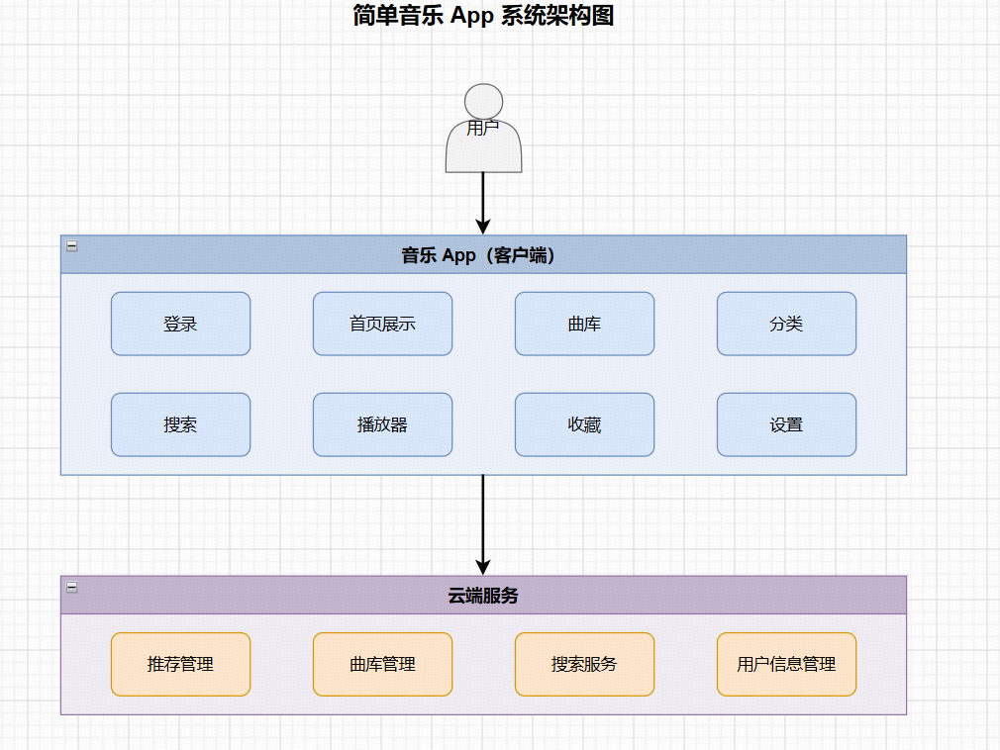</td>
<td width="50%" align="center"><b>drawio-skill</b><br>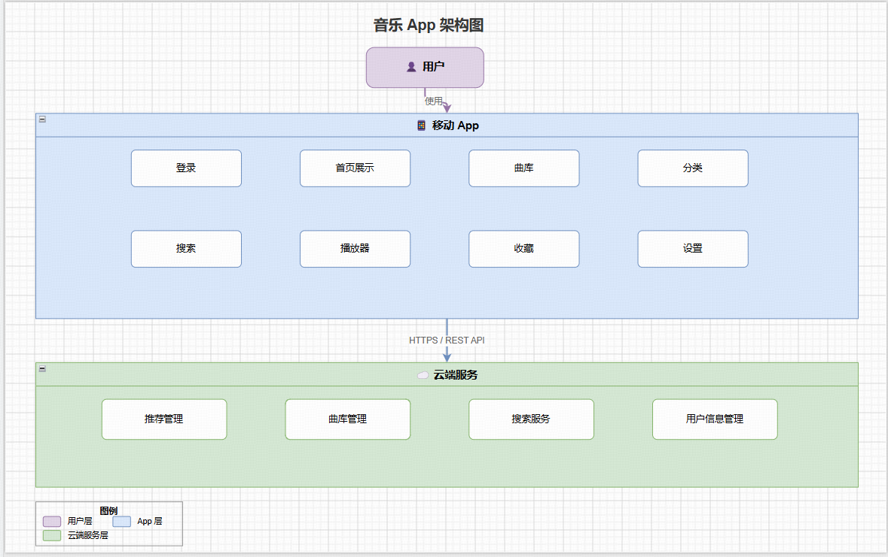</td>
</tr>
</table>

**Side-by-side (app store functional architecture):**

<table>
<tr>
<td width="50%" align="center"><b>xiaosu-draw-ai</b><br>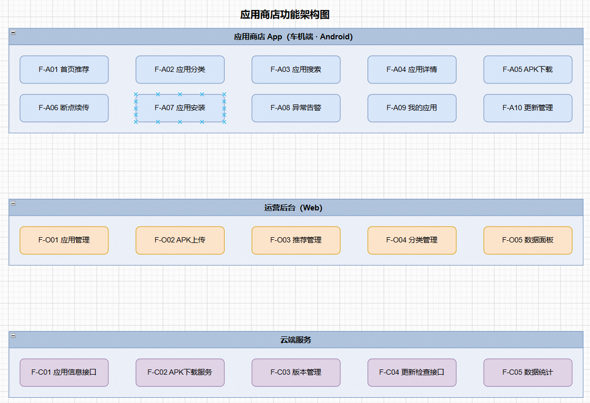</td>
<td width="50%" align="center"><b>drawio-skill</b><br>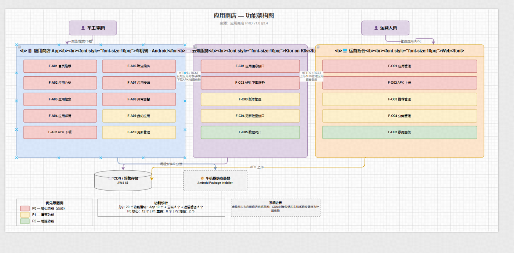</td>
</tr>
</table>

**Core difference:** xiaosu-draw-ai adds a "user interaction layer" (templates + IR summary confirmation) and a "quality loop" (P0-P3 + visual audit decision table) on top of a generic toolbox — an assistant that asks, audits, and delivers.

---

## Token Consumption

| Metric | Simple diagram (16 nodes, 7 edges) | Complex diagram (59 nodes, 30 edges) |
|--------|-------------------------------------|--------------------------------------|
| Input tokens | ~26,000 | ~26,000 |
| Output tokens | ~8,000 | ~8,000 |
| Time | ~2 min | ~5 min 30s |
| Pipeline | C | C (Python script) |
| Est. cost (Opus 4.8) | ~$0.20 | ~$0.33 |

> Input tokens mostly come from on-demand rule files (SKILL.md + xml-authoring.md + rules.md + style JSON), loaded stage by stage. Say "benchmark" for precise per-session metrics via `benchmark.md`. Actual consumption varies with diagram complexity, cache hits, and conversation context.

---

## Development

```bash
# Structural lint
python3 skills/xiaosu-draw-ai/scripts/validate.py <file.drawio> --score

# Export preview / final
node skills/xiaosu-draw-ai/scripts/export.js <file.drawio>
node skills/xiaosu-draw-ai/scripts/export.js <file.drawio> --final

# Build distributable package
node skills/xiaosu-draw-ai/scripts/build.js

# Run tests
python3 -m pytest tests/unit/ -v
node tests/integration/test_golden_regression.js
```

---

## Project Structure

```
xiaosu-draw-ai/
├── README.md / README_EN.md
├── CLAUDE.md                         # Developer routing guide
├── LICENSE
│
├── doc/                              # Design doc + README images
│   ├── DESIGN.md
│   └── img/
│
├── skills/xiaosu-draw-ai/            # The Skill package
│   ├── SKILL.md                      # Agent workflow entry point
│   ├── references/                   # 12 on-demand rule documents
│   ├── templates/                    # 20 prompt templates (zh/ + en/)
│   ├── styles/                       # Schema + 7 built-in JSON presets
│   ├── scripts/                      # 12 scripts (validate, export, build, etc.)
│   └── data/                         # Reserved structured data
│
├── tests/                            # L0-L2 test suite
├── .drawio/                          # Dev verification diagrams
├── .github/workflows/                # CI (4 jobs)
└── .claude/skills/                   # Build output (do not edit)
```

---

## License

MIT
