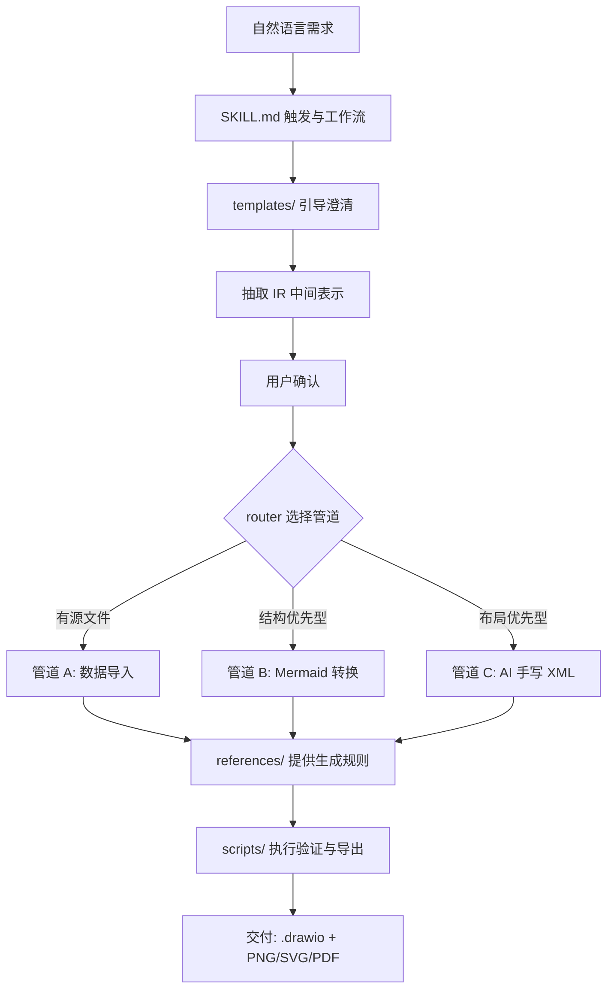
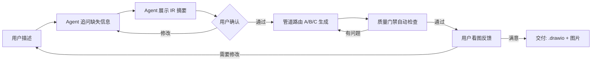
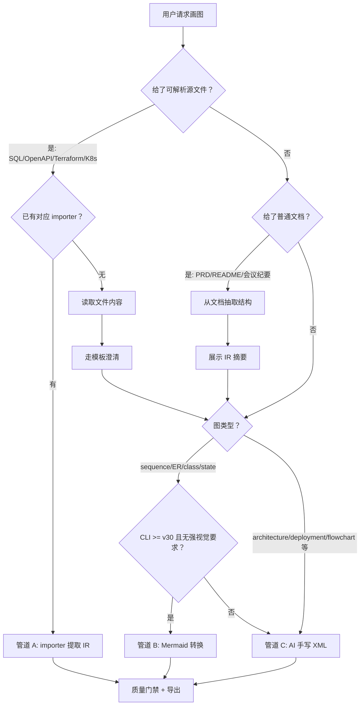
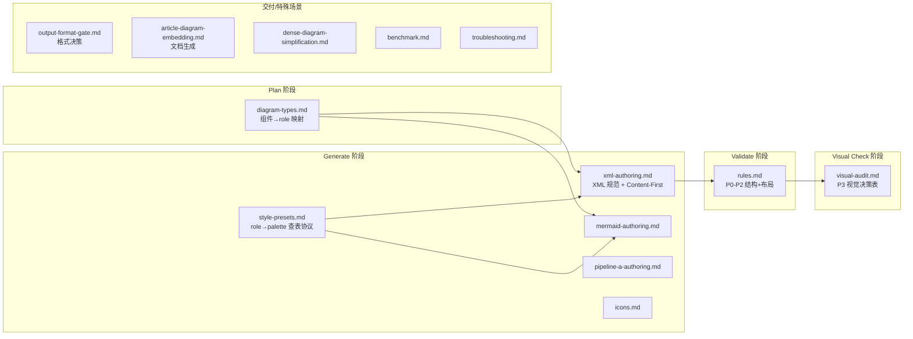

# xiaosu-draw-ai 设计文档

> **定位**：本文档只记录 repo 推导不出来的东西——设计决策与取舍（含证伪条件）、概念模型（三管道 / IR / 质量门禁如何咬合）、平台边界与非目标。"是什么、怎么改、怎么装、怎么测"以 repo 为唯一源，入口见 §5 实现导航。
>
> **北极星**：让任何支持 Skill 的 Agent，都能用自然语言稳定产出"结构正确、视觉可读、可继续编辑"的 draw.io 图。

---

## 0. 这是什么

`xiaosu-draw-ai` 是一个**可安装、可验证、可演进的 AI 制图 Skill**：纯 SKILL.md + draw.io CLI 驱动，不与任何 Agent 平台耦合。



五条设计原则：

1. **以 `SKILL.md` 为产品核心**，不是以架构文档为核心。
2. **以可执行规则替代概念描述**，每条规则都要能指导 Agent 下一步动作。
3. **以安装边界和平台边界消除误导**，不写虚构安装命令，不把不同形态的 Skill/Agent 混为一谈。
4. **以 IR（中间表示）作为三管道粘合层**，让自然语言、Mermaid、数据导入器、XML 生成共享同一套质量流程。
5. **以质量门禁作为不可跳过的流程**，而不是"生成完后顺手检查"。

---

## 1. 工作原理：一次画图的生命周期

用户不想学 draw.io XML，也不想学 Mermaid，更不想懂 P0/P1/P2。用户只说一句"帮我画一下这个系统"，Skill 把它变成稳定流程：



内部按五层划分，每层职责与核心落点：

| 层 | 职责 | 核心落点 |
|----|------|---------|
| L1 意图层 | 自然语言 → 模板引导 → 抽取 IR → 人审核 | `templates/*.md` |
| L2 路由层 | IR → 判断管道 A/B/C | `SKILL.md`（路由决策树） |
| L3 生成层 | A: importer→IR→XML；B: Mermaid→CLI 转换；C: AI 手写 XML | `scripts/`、`references/` |
| L4 质量层（不可跳过） | validate.py（P0-P2）→ audit.js（P3）→ AI 视觉审计 | `scripts/validate.py`、`scripts/audit.js`、`references/visual-audit.md` |
| L5 交付层 | CLI 导出 → 源文件 + PNG/SVG/PDF → [飞书嵌入] | `scripts/export.js`、`references/output-format-gate.md` |

三个贯穿性约定：

- **展示给用户的是人话摘要，不是 JSON 原文**——用户确认的是理解，不是格式。
- **预览导出与最终导出分离**：预览 PNG 不嵌 XML（给视觉模型/用户看，文件干净）；最终 PNG 嵌入源文件（可在 draw.io 重新打开编辑）。
- **按需加载**：`SKILL.md` 入口保持短小，只写"什么阶段读哪个文件"（Bundled Resources 表）；规则、语法、样式细节全部外置到 `references/` 与 `styles/`。

---

## 2. 关键机制

### 2.1 三管道与路由

| 管道 | 输入 | 适用场景 | 输出 | 核心风险 |
|------|------|---------|------|---------|
| A：Data-driven | SQL / OpenAPI / Terraform / K8s / 代码 | 用户已有可解析源文件 + importer 已实现 | IR → XML | 导入器解析不完整 |
| B：Mermaid | 自然语言 → Mermaid | 时序图、ER、类图、状态机等结构优先图 | `.mmd` → `.drawio` | 样式控制弱，依赖 CLI ≥ v30 |
| C：Hand-written XML | 自然语言 / 结构化 IR | 架构图、部署图、流程图、C4、网络拓扑 | `.drawio` XML | 坐标、边、视觉质量易出错 |

决策树把"数据来源"和"渲染方式"解耦：



**美观正交原则**：

> 数据来源决定"结构怎么来"；美观诉求决定"渲染怎么做"。两者正交。

"精美 / 漂亮 / professional / keynote-ready"不是路由触发词，而是**视觉控制要求**：时序图 + 漂亮 → 从管道 B 降级管道 C；SQL → ER + 漂亮 → A 解析结构、C 渲染视觉。多信号组合（如"代码 + 时序图 + 美观"）按"数据来源优先"兜底，不让触发词在决策树里互相打架。

### 2.2 IR：三管道的粘合层

> IR 是"图的骨架"，XML 是"图的皮肤"。骨架稳定，皮肤才能换。

没有 IR，A/B/C 只是三套互不相干的实现。IR 同时服务四件事：用户确认（把 Agent 的理解展示出来）、importer 统一输出、B/C 共同消费、结构化 diff 与测试比较。

Base IR 骨架（完整 schema、sequence/ER 等图类型扩展见 `references/pipeline-a-authoring.md`，契约测试见 `tests/unit/test_ir_schema.js`）：

```json
{
  "schemaVersion": "1.0",
  "diagram": { "type": "architecture", "title": "电商系统架构图", "language": "zh", "intent": "…" },
  "nodes":  [{ "id": "api-gateway", "label": "API 网关", "kind": "gateway", "role": "primary", "layer": "gateway" }],
  "edges":  [{ "id": "web-to-gateway", "source": "web-app", "target": "api-gateway", "kind": "primary" }],
  "groups": [{ "id": "service-layer", "label": "业务服务层", "nodeIds": ["user-service", "order-service"] }],
  "layout": { "direction": "TB", "layers": [["web-app"], ["api-gateway"], ["user-service"], ["mysql"]] },
  "style":  { "preset": "flat-icon", "emphasis": ["api-gateway"] },
  "source": { "type": "natural-language", "path": null }
}
```

图类型只**扩展**必要字段（sequence 加 participants/messages，ER 加 entities/relationships），不推翻 Base IR。

### 2.3 质量门禁

> 能机器判断的，不让 Agent 用肉眼猜；必须肉眼判断的，写成视觉检查决策表。

| 层级 | 名称 | 检查者 | 是否阻断 | 例子 |
|------|------|--------|---------|------|
| P0 | 结构损坏 | `validate.py` | 是，exit 2 | XML 不合法、悬空边、重复 ID |
| P1 | 布局缺陷 | `validate.py` | 是，exit 1 | 节点重叠、边穿节点、出界 |
| P2 | 质量警告 | `validate.py` | 否，exit 0 | 偏离 10px 网格、连接点不居中 |
| P3 | 视觉问题 | `audit.js` + AI 视觉 | 否，但应修 | 标签溢出、边标签缺背景、图例遮挡 |

exit code 集中定义（`validate.py --help`、`references/rules.md`、`audit.js` 与本文档必须一致）：

| exit code | 含义 | Agent 动作 |
|-----------|------|-----------|
| 0 | 无 P0/P1；可能有 P2 warning | 可继续，必要时优化 |
| 1 | 存在 P1 must-fix | 修复后重跑，最多 3 轮 |
| 2 | 存在 P0 blocking | 必须修复；不能导出最终图 |

分工：`validate.py`（Python，P0-P2 结构 + 几何）→ `audit.js`（Node，P3 启发式 + 聚合 validate 子进程）→ `visual-audit.md`（AI 看导出 PNG 的决策表）。

三条硬性立场：

- **三管道统一进同一质量门禁**。Mermaid 转换完也要跑 validate + 预览导出，不能因为方便就跳过。
- **P3 规则必须写成决策表**（Agent 看到什么 → 优先修法 → XML before/after 示例），不允许只有规则名。
- **修复有轮数上限**（P0/P1 最多 3 轮，P3 自检最多 2 轮）；视觉检查不可用时明确说"跳过"，不假装看过。

像素级规则全集（R001+）与检查阈值见 `references/rules.md`；规则定义与 validate.py 检测实现必须同步演进（见 CLAUDE.md 测试触发规则）。

### 2.4 样式：把审美变成参数

内置风格预设是**可查表的生成参数集**（palette/roles/shapes/font/edges/extras），不是文字描述。生成 XML 时按协议查表，不凭感觉配色：

- 节点 `role` → `roles[role]` → `palette[key]` → fill/stroke
- 边 `kind` → `edges[kind]` → style 串（primary/async/memoryRead/memoryWrite/control/feedback/neutral 七种语义边，图内始终带 legend 说明箭头语义）
- 形状 `kind` → `shapes[kind]` → shape prefix

查表协议与风格合并规则见 `references/style-presets.md`，预设 JSON 见 `styles/built-in/`。

---

## 3. 设计决策与理由（含证伪条件）

每条决策都附"证伪条件"——出现该条件时，决策需重新评估，而非固守。

| 决策 | 结论 | 理由 | 证伪条件 |
|------|------|------|---------|
| 后端引擎 | **draw.io CLI 为主** | CLI 保可编辑源文件，覆盖所有场景 | CLI 在无头/沙箱环境频繁失败且无稳定 fallback → 评估增加 SVG 直写后端 |
| 用户输入格式 | **Markdown 提示词模板**，非 YAML | 用户填自然语言，AI 负责结构化；人能审核结构化结果 | 模板引导仍导致用户描述质量过低 → 增加结构化字段（仍非 YAML 强制） |
| 与旧 drawio 工程关系 | **完全独立新工程** | P0-P3 规则 / validate / 嵌入参考但重写 | — |
| 质量脚本 | **validate.py + audit.js 双脚本** | validate.py = 结构正确性（P0-P2，Python XML 解析）；audit.js = 视觉质量启发式（P3）+ 聚合 wrapper | 两脚本职责边界长期模糊 → 合并或重新划界 |
| 管道 B 路由 | 结构优先型**默认 Mermaid**；"漂亮/精美"→ 降级管道 C | Mermaid 结构稳定优先级高；视觉美化走手写 XML | draw.io CLI < v30 → 自动降级管道 C |
| 管道 A 路由 | 用户**提供可解析源文件**且**对应 importer 已实现**时触发 | 数据来源决定结构怎么来 | 无对应 importer → 读取文件内容走模板澄清，进 B/C |
| styles/ 定位 | **完整生成参数集**（palette/roles/shapes/font/edges/extras） | AI 查表决定所有 style 属性，而非凭感觉配色 | — |
| 版本源 | **SKILL.md frontmatter 为唯一版本源**（已实施） | Skill 包的天然元数据入口；不依赖"人工记得同步" | 保留 VERSION 则 build 强校验一致，二选一 |
| SKILL.md 语言 | **英文** | token 效率高、全球 Agent 兼容、开源社区惯例 | — |
| 用户交互语言 | **templates/zh + en 分目录** | 目标用户母语描述，示例与引导本地化 | — |

### 为什么不……（对抗性自检）

**Q1：为什么不直接复用 drawio-skill？**
目标不同。drawio-skill 是强大的通用工具箱；本项目是面向自然语言用户的质量优先制图 Skill。前者像"专业画图软件工具箱"，后者像"会追问、会审图、会交付的画图助理"。

**Q2：为什么还要 IR，直接生成 XML 不行吗？**
短期可以，长期会乱。没有 IR 时：用户确认只能看文字、A/B/C 无法共享结构、测试难比较结构正确性、XML diff 难读。IR 是骨架，XML 是皮肤。

**Q3：为什么不把所有规则写进 SKILL.md？**
Skill 入口要短。太长导致触发成本高、Agent 难抓主流程、修改规则易污染入口。正确做法是入口写"什么时候读哪个文件"（按需加载表）。

**Q4：为什么不默认 Managed Agents？**
当前用户要的是本地工程 Skill，不是云端 Agent 服务。先把 Skill 包做好，再考虑云端适配。

**Q5：为什么安装命令这么保守？**
错误安装命令比没有安装命令更糟。虚构的 `npx skills add` 会让用户从第一步失败。

**Q6：为什么是 Python + Node.js 两种语言？**
Python ElementTree 解析 XML 最可靠（validate.py 核心）；Node.js 的 regex + geometry math 更适合启发式检测（audit.js 核心）。subprocess + JSON 通信，不共享代码但共享数据格式。

---

## 4. 边界与非目标

### 平台边界：不混淆三种 Skill / Agent

| 名称 | 它是什么 | 和本项目的关系 | 不要混淆 |
|------|---------|--------------|---------|
| **Claude Code Skill** | 本地文件夹中的 `SKILL.md` + 资源，Agent 按需加载 | **当前主形态，已实现** | 不是 Claude API 的 `agents` 机制 |
| **Claude API Agent Skills** | API 中通过容器技能机制启用的能力 | 可适配，非默认（见 `references/claude-api-agent-skills.md`） | 不等于本地 `.claude/skills` |
| **Managed Agents Skills** | 托管 Agent 配置引用的 Skills 资源 | 云端形态（见 `references/managed-agents-adaptation.md`） | 不等于"每次运行都新建 Agent" |

> 本项目的主形态是**本地 Skill 包**。它可以被不同 Agent 平台读取，但它本身不是 Agent，也不是托管 Agent。

Managed Agents 适配时的边界约束：

1. Agent 是持久对象，Session 是每次运行——不能在每次请求里创建新 Agent；`model`/`system`/`tools`/`skills` 属于 Agent 配置，Session 只引用已有 Agent。
2. Skill 应被 Agent 配置引用，不应在运行时临时拼进用户消息。
3. 密钥放 Vault，不放 `SKILL.md`、不放 system prompt、不放 memory。

### 非目标

- **不 fork / import / cherry-pick 参考框架**（drawio-skill、fireworks-tech-graph、architecture-diagram-generator）——借鉴设计模式，重新实现。
- **不写虚构内容**：虚构安装命令（`npx skills add`）、无代码对应的测试数字（"53 tests"）一律不进文档。
- **不为云端形态牺牲本地 Skill 的简洁性**。
- 上游依赖约束：draw.io CLI 锁定 ≥ 24.0.0（install.js 检查）；CLI 大版本更新需跑 Golden 回归，审计分数不退化。

---

## 5. 实现导航

设计之外的一切以 repo 为源：

| 你想知道什么 | 看哪里 |
|-------------|--------|
| Skill 行为、工作流、按需加载表 | `skills/xiaosu-draw-ai/SKILL.md` |
| 改什么动哪里（修改路由表）、开发命令、测试触发规则 | `CLAUDE.md` |
| P0-P3 规则全集与检查阈值 | `skills/xiaosu-draw-ai/references/rules.md` |
| 目录结构、安装与使用 | `README.md`（中文）/ `README_EN.md`（英文） |
| 变更历史 | `CHANGELOG.md` + git log |
| 本文档旧版（含 Phase 0-5 实施路线、验收标准、目录结构详解、SKILL.md 编写规范、测试体系） | git 历史（2026-07-15 之前的 `doc/DESIGN.md`） |

---

## 6. Skill 包目录与文件说明

以下为 `skills/xiaosu-draw-ai/` 下每个文件和目录的职责、加载时机（按需加载阶段）、以及与其他文件的依赖关系。

```
skills/xiaosu-draw-ai/
│
├── SKILL.md                          # 🎯 Agent 行为入口（约 30KB）
│   # 触发条件 → 模板选择 → IR 抽取 → 管道选择
│   # → 生成 → 质量门禁 → 导出 → 交付
│   # 含 Bundled Resources 按需加载表（何时读哪个文件）
│
├── data/                             # 📊 结构化索引（预留）
│   └── README.md                     #    当前无实际数据文件
│
├── references/                       # 📚 15 份外置专业知识（按需加载）
│   ├── rules.md                      # P0-P2 规则全集 + exit code + 评分权重（结构 + 布局）
│   ├── visual-audit.md               # P3 AI 视觉审计决策表（独立的视觉规则，see→fix→XML 示例）
│   ├── style-presets.md              # 样式查表协议 + 风格合并规则 + 兼容矩阵
│   ├── diagram-types.md              # 10 类图预设：组件→role 映射 + 形状/布局/边语义（色值从 style JSON 查表）
│   ├── xml-authoring.md              # Pipeline C：XML 著述规范 + Content-First 7 步流水线
│   ├── mermaid-authoring.md          # Pipeline B：Mermaid 语法 → CLI 转换 + 降级策略
│   ├── pipeline-a-authoring.md       # Pipeline A：importer API + IR schema 契约
│   ├── icons.md                      # 60+ 产品品牌色 + 图标映射
│   ├── output-format-gate.md               # 交付前必查：目标平台 → 输出格式决策矩阵（Mermaid vs PNG）
│   ├── article-diagram-embedding.md  # 模板驱动文档生成 + @xiaosu-draw-ai 标注
│   ├── dense-diagram-simplification.md # 稠密图简化：5 策略 + 决策流（≥15 节点触发）
│   ├── benchmark.md                  # 性能度量：计时 + Token 统计 + 报告格式
│   ├── troubleshooting.md            # 跨平台故障排除
│   ├── claude-api-agent-skills.md    # Phase 5 适配：Claude API Agent Skills 容器化
│   └── managed-agents-adaptation.md  # Phase 5 适配：Managed Agents 云端托管
│
├── styles/                           # 🎨 7 套视觉风格（JSON 预设）
│   ├── schema.json                   # JSON Schema（必填字段定义）
│   └── built-in/                     # 7 个预设（flat-icon 为默认）
│       ├── flat-icon.json            #    白底蓝主色 · 圆角 · Helvetica
│       ├── dark-terminal.json        #    深底霓虹 · 直角 · Courier New
│       ├── blueprint.json            #    深蓝底青白线 · 直角 · Courier New
│       ├── notion-clean.json         #    白底低饱和 · 圆角 · Helvetica
│       ├── glassmorphism.json        #    深渐变底磨砂 · 圆角 · Helvetica
│       ├── claude-official.json      #    暖白底柔影 · 圆角 · Helvetica
│       └── openai.json               #    白底细线框 · 圆角 · Helvetica
│
├── templates/                        # 📝 20 个中英文提示词模板
│   ├── zh/                           # 中文模板（10 类图，引导问题 + 约束段）
│   └── en/                           # 英文模板（10 类图，部分未完整翻译）
│
└── scripts/                          # 🔧 13 个脚本（详见 CLAUDE.md §修改路由表）
    ├── validate.py                   # P0-P2 结构 lint（Python 3，ElementTree）
    ├── audit.js                      # P3 启发式 + 聚合 wrapper（Node.js）
    ├── export.js                     # PNG/SVG/PDF 导出封装（draw.io CLI 封装）
    ├── mermaid-convert.js            # Pipeline B：Mermaid → draw.io 转换
    ├── router.js                     # 正交路由引擎 + 并行边分布 + 障碍规避
    ├── xml-parser.js                 # 已有图 XML → JSON 结构解析
    ├── png-extract.js                # PNG 嵌入 XML 提取
    ├── build.js                      # 打包构建（读版本 → 校验完整性 → 输出 .claude/skills/）
    ├── install.js                    # 跨平台安装助手
    ├── utils.js                      # 公共工具（路径/版本/二进制检测）
    └── importers/                    # Pipeline A 导入器
        ├── ir-importer.js            #    IR 导入器接口
        ├── sql2er.js                 #    SQL DDL → ER 图
        └── openapi2arch.js           #    OpenAPI → 架构图
```

### 颜色查表链（核心机制）

组件颜色经过三级查找，每一级只负责一件事：

```
组件类型（"用户服务"）
  → ① template 或 diagram-types.md：组件→语义 role（service）
  → ② style JSON roles：语义 role→palette slot（primary）
  → ③ style JSON palette：palette slot→实际色值（fillColor/strokeColor/fontColor）
```

| 级 | 谁定义 | 例子 |
|----|--------|------|
| ① 组件→role | `templates/` 约束段 + `diagram-types.md` Color Assignments | "服务组件 → role: service" |
| ② role→slot | 风格 JSON `roles` 字段 | `"service": "primary"` |
| ③ slot→色值 | 风格 JSON `palette` 字段 | `"primary": {"fillColor": "#0d1f3c", "strokeColor": "#00b4d8"}` |

**优先级**：风格 JSON 的 `shapes` 字段覆盖 `diagram-types.md` 的 shape token；风格 JSON 的 `font` 字段覆盖 `rules.md` R034 的字体 px 值（层级结构保留，具体数值可变）。

### references/ 文件按需加载关系



---

> 这个项目的关键不是"AI 能不能画图"，而是"AI 每次画图时有没有一套稳定的 Skill 框架约束它别乱画"。
